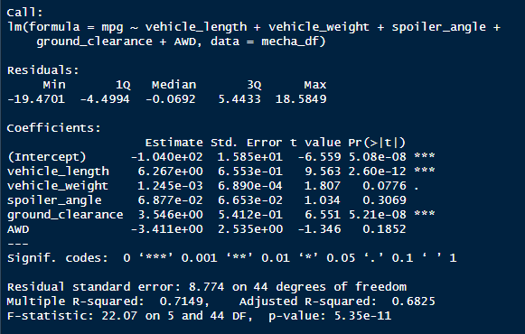
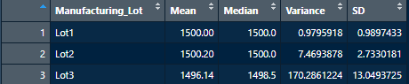
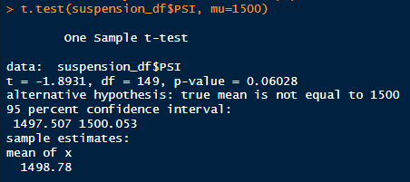
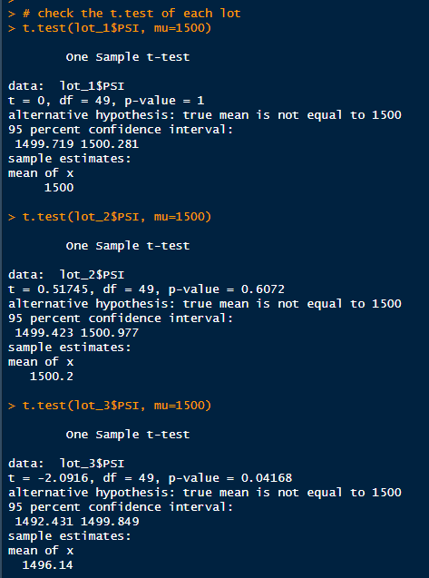

# MechaCar Statistical Analysis

---

## Project Overview

A few weeks after starting his new role, Jeremy is approached by upper management about a special project. AutosRUs’ newest prototype, the MechaCar, is suffering from production troubles that are blocking the manufacturing team’s progress. AutosRUs’ upper management has called on Jeremy and the data analytics team to review the production data for insights that may help the manufacturing team.

In this challenge, you’ll help Jeremy and the data analytics team do the following:

- Perform multiple linear regression analysis to identify which variables in the dataset predict the mpg of MechaCar prototypes.
- Collect summary statistics on the pounds per square inch (PSI) of the suspension coils from the manufacturing lots.
- Run t-tests to determine if the manufacturing lots are statistically different from the mean population.
- Design a statistical study to compare vehicle performance of the MechaCar vehicles against vehicles from other manufacturers. For each statistical analysis, you’ll write a summary interpretation of the findings.

---

## Linear Regression to Predict MPG

Pulling the data from the [Suspension_Coil.csv](Resources/Suspension_Coil.csv) and performing a linear regression across all rows of vehicle information against mpg, the output of co-efficients/variables can be seen below.

Based on the p-values of the coefficients, the only variables that are showing a non-random effect on mpg would be the variables with p-values less than 0.05. Vehicle length and ground clearance have provided p-value numbers that suggest non-random effect on mpg. Spoiler angle, vehicle weight, and AWD p-values indicate a random amount of variance in the dataset.

The p-value of the linear model is 5.35e-11. This provides sufficient evidence of a sloped linear model that is not zero and rejects the null hypothesis.

The r-squared value of the linear model predicts the MechaCar protypes effectively as it's value is 0.7149 or roughly 71.5%. This means that approximately 71.5% of the observed variation can be explained by the models inputs.

---

## Summary Statistics on Suspension Coils

Checking the PSI of combined lots provided by the [MechaCar_mpg.csv](Resources/MechaCar_mpg.csv) data, we can see that the variance across all three lots average variance is 62.29 with a standard deviation of 7.89.

The MechaCar suspension coils dictates that the variance of the suspension coils not exceed 100 pounds per square inch (PSI). When analyzing the data by Manufacturing Lot (image below) we can see that Lot3 has a variance of over 170. This suggests that Lot3 is not within the manufactures specifications and causing variance in the combined lot variance skewing the data. The standard deviation of Lot3 is ~13 while Lot2 and Lot1 are much narrower between 1-3. Lot3's higher SD supports the the hypothesis that variance PSI is too high in this lot and needs to be addressed.

---

## T-Tests on Suspension Coils

briefly summarize your interpretation and findings for the t-test results. Include screenshots of the t-test to support your summary.

T.tests were performed on the entirety of the lots which provided a p-value of 0.06 supporting our previous summary and does not provide enough evidence to reject the null hypothesis.

Then breaking out each lot individually and running the t.test provides a more indepth look at each. Lot1 and Lot2 have p-values above the significant level of 0.05 which does not support a rejection of our null hypothesis for those two Manufacturer Lots.

However, Lot3 has a p-value of under 0.05 as expected which is of significance evidence to reject the null hypothesis. This adds further to our previous interpretation of the variance and standard deviation in the statistics exercise.

Based on these findings, it would be highly suggested that MechCar has lot3 vehicles inspected and audited to ensure the vehicles that outside of their 100 PSI suspension coil variance are rectified.

---

## Study Design: MechaCar vs Competition

To better understand MechaCar's value to consumer, we can measure the statistical metrics of MechaCar and their performance against their competition. To study this relationship the following study design will accomplish this goal.

#### Design Requirements:

- Collect measurable metrics on MechaCar and it's competitor's vehicles over the last 5 years
- Create a null and alternative hypothesis to test the metrics against
- Testing of the hypothesis through means of statistical analysis

#### Metrics

**Dependent Variables**

- Consumers Purchasing Price

**Independent Variables**

- Horsepower
- Torque
- Safety Rating
- Maintenance Cost
- Highway Fuel Efficiency
- Depreciation Rate

#### Hypothesis

**Null Hypothesis**
MechaCar's vehicle value is correctly priced in line with it's competitors for model and size

**Alternative Hypothesis**
MechaCar's vehicle value is incorrectly priced when compared to it's competitors due to one of the independent variables being tested.

#### Statistical Test

Testing of this analysis will be done with a multiple linear regression to determine the relationship between the consumers purchasing price and the independent variables. Results depend upon the what variables show any signs of significant variance and/or p-values that either support or reject the null hypothesis. Additional testing can be done to support the findings through box whiskey plots as a visual aid as well as looking more indepth by variable using single linear regression.
